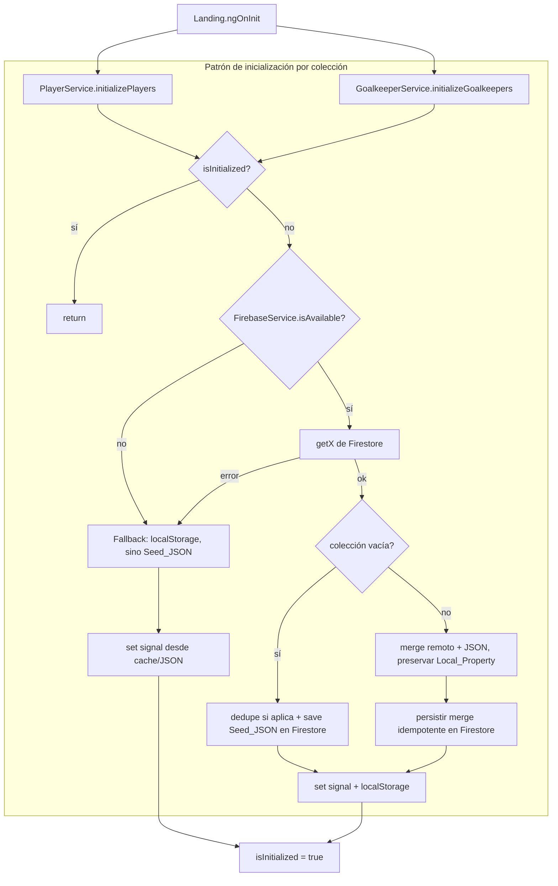

# Design Document

## Overview

Esta feature completa la integración de **cli-futbol-app** con **Cloud Firestore** para persistir de forma centralizada tanto los jugadores de campo (`players`) como los arqueros (`goalkeepers`). El estado actual del código (verificado leyendo el código real, no supuesto) es:

- `FirebaseService` ya inicializa Firebase en su constructor (`initializeApp` + `getFirestore`) y expone operaciones CRUD **solo** para la colección `players` (`getPlayers`, `savePlayer`, `updatePlayer`, `deletePlayer`, `savePlayers`). No maneja el fallo de inicialización ni los placeholders de config: si `environment.firebase` tiene los valores `TU_API_KEY`, etc., o si Firestore falla, las operaciones lanzan y hoy no hay contención.
- `PlayerService` ya implementa el patrón objetivo: `initializePlayers()` con guard `isInitialized`, lectura desde Firestore, merge con el JSON (preserva `image`/`order`), re-guardado idempotente, y fallback `try/catch → localStorage → JSON`. Se dispara en `Landing.ngOnInit()`.
- `GoalkeeperService` es **puramente local**: inicializa un `signal` desde `goalkeepers.json` + no lee de Firestore, no persiste en Firestore, y no tiene inicialización asíncrona. Solo escribe `localStorage` en `toggleGoalkeeper`. Aplica `maxSelected = 2`.
- `goalkeepers.json` contiene **IDs duplicados**: dos documentos con `id: "gk5"` (Yonathan y Ricardo). Esto rompe cualquier upsert por `id` en Firestore (el segundo sobrescribe al primero).

El objetivo del diseño es, sin reescribir lo que ya funciona:

1. **Extender `FirebaseService`** con operaciones para `goalkeepers` y con manejo robusto de config-placeholder / fallo de init (flag de disponibilidad, sin romper la app).
2. **Formalizar un seed idempotente** para ambas colecciones: sembrar solo si la colección remota está vacía; si tiene datos, usarlos como fuente.
3. **Deduplicar IDs de arqueros** de forma determinística durante el seed, preservando `name`/`skill`/`selected`/`image`.
4. **Elevar `GoalkeeperService`** al mismo patrón que `PlayerService` (init async, Firestore, merge, fallback, upsert por `id`, `maxSelected = 2`).
5. **Aislar la lógica pura** (seed / merge / dedupe) en funciones sin dependencia de Firestore, de modo que sea testeable con Vitest + property-based testing sin un Firestore real.

### Principio de diseño transversal

La lógica de negocio (dedupe, merge, decisión de seed) se extrae a **funciones puras** en un módulo `sync` sin dependencias de Angular ni de Firebase. Los servicios (`FirebaseService`, `PlayerService`, `GoalkeeperService`) orquestan I/O y delegan las transformaciones a esas funciones puras. Esto es lo que habilita el testing property-based sin tocar Firestore.

## Architecture

### Componentes y responsabilidades

| Componente | Responsabilidad | Estado |
|-----------|-----------------|--------|
| `FirebaseService` | Encapsula Firestore. Init con detección de config-placeholder y captura de fallo → flag `isAvailable`. CRUD de `players` y `goalkeepers`. | Extender |
| `PlayerService` | Signals + estado de Player. `initializePlayers()`, merge, fallback, persistencia. | Ajustar (usar funciones puras + flag de disponibilidad) |
| `GoalkeeperService` | Signals + estado de Goalkeeper. `initializeGoalkeepers()` async, merge, fallback, persistencia, `maxSelected`. | Extender fuerte (análogo a PlayerService) |
| `sync/data-sync.ts` (nuevo) | Funciones **puras**: `dedupeGoalkeeperIds`, `mergePlayers`, `mergeGoalkeepers`, `decideSeed`. Sin Angular ni Firebase. | Nuevo |
| `Landing` (page) | Dispara la inicialización en `ngOnInit`. Hoy llama `initializePlayers()`; se agrega `initializeGoalkeepers()`. | Ajustar |

### Flujo de arranque, seed, merge y fallback



Notas del flujo, atadas a los requisitos:

- **`isAvailable`** (Req 1.4, 1.5): se calcula una sola vez en el constructor de `FirebaseService`. Si la config son placeholders o `initializeApp`/`getFirestore` lanzan, `isAvailable = false`, se loguea un error descriptivo y todas las operaciones remotas se convierten en no-op controlado (los servicios caen al camino de fallback). La app nunca se rompe por Firebase.
- **Decisión de seed vs merge** (Req 2.1–2.4): depende de si la colección remota está vacía. Vacía → seed; con datos → merge usando remoto como fuente.
- **Dedupe** (Req 3): se aplica **solo en el camino de seed de goalkeepers**, sobre `Seed_JSON`, antes de escribir. Una vez sembrados con IDs únicos, los arranques siguientes leen datos ya únicos.
- **Idempotencia** (Req 2.5, 6.6): el seed usa upsert por `id` y solo corre con colección vacía; el merge es una función pura determinística cuyo re-aplicado sobre la misma entrada produce el mismo resultado.
- **Fallback** (Req 5): cualquier error de lectura cae a `localStorage`; si no hay cache, a `Seed_JSON`. Cualquier error de escritura conserva el cambio en `localStorage` y loguea.

## Components and Interfaces

Todas las firmas están en TypeScript real, coherentes con el código existente (Angular 21 standalone + signals, `firebase/firestore` modular).

### Módulo puro `src/app/services/sync/data-sync.ts` (nuevo)

```typescript
import { Player, Goalkeeper } from '../../models/player.model';

/**
 * Resultado del dedupe de arqueros: la lista corregida y el registro de qué cambió.
 */
export interface DedupeResult {
  goalkeepers: Goalkeeper[];              // lista con ids únicos, mismo orden de entrada
  reassignments: Array<{                  // uno por cada gk cuyo id fue reasignado
    oldId: string;
    newId: string;
    name: string;
  }>;
  duplicateIds: string[];                 // ids que aparecían más de una vez en la entrada
}

/**
 * Detecta ids repetidos y reasigna un id único DETERMINÍSTICO a las apariciones
 * posteriores a la primera, preservando name/skill/selected/image.
 *
 * Regla de reasignación (determinística, sin aleatoriedad ni timestamps):
 *   - La PRIMERA aparición de un id conserva su id original.
 *   - Cada aparición siguiente del mismo id recibe `${id}-${n}` con n = 2,3,...
 *     según el orden de aparición.
 *   - Si el id candidato `${id}-${n}` ya existe en la lista de entrada,
 *     se incrementa n hasta encontrar uno libre (garantiza unicidad global).
 * Ej.: [gk5(Yonathan), gk5(Ricardo)] -> [gk5(Yonathan), gk5-2(Ricardo)].
 */
export function dedupeGoalkeeperIds(goalkeepers: Goalkeeper[]): DedupeResult;

/**
 * Fusiona la lista remota (fuente de estado) con Seed_JSON (fuente de
 * presentación) para Player. Regla por documento remoto:
 *   - se parte del Player remoto (fuente de verdad del estado),
 *   - si el remoto NO tiene `image` y el JSON correspondiente (por id) SÍ,
 *     se asigna el `image` del JSON,
 *   - si el remoto NO tiene `order` y el JSON SÍ, se asigna el `order` del JSON,
 *   - el remoto conserva su `image`/`order` cuando ya los tiene.
 * Documentos remotos sin par en el JSON se conservan tal cual.
 * Determinística e idempotente: mergePlayers(mergePlayers(r,j), j) == mergePlayers(r,j).
 */
export function mergePlayers(remote: Player[], seed: Player[]): Player[];

/**
 * Análogo a mergePlayers para Goalkeeper, preservando solo `image`.
 *   - parte del Goalkeeper remoto,
 *   - si el remoto NO tiene `image` y el JSON (por id) SÍ, asigna el del JSON.
 * Determinística e idempotente.
 */
export function mergeGoalkeepers(remote: Goalkeeper[], seed: Goalkeeper[]): Goalkeeper[];

/**
 * Decide, dado el contenido remoto, cuál es el estado inicial y si hay que sembrar.
 *   - remote.length === 0  -> { action: 'seed',  data: seedPrepared }
 *   - remote.length > 0     -> { action: 'merge', data: merge(remote, seed) }
 * Nota: para goalkeepers, `seedPrepared` es el resultado de dedupeGoalkeeperIds(seed).goalkeepers.
 */
export interface SeedDecision<T> {
  action: 'seed' | 'merge';
  data: T[];
}
export function decideSeed<T extends { id: string }>(
  remote: T[],
  seedPrepared: T[],
  merge: (r: T[], s: T[]) => T[]
): SeedDecision<T>;

/** Invariante de dominio reutilizable en tests y en el servicio. */
export function countSelected(goalkeepers: Goalkeeper[]): number;
```

### `FirebaseService` (extender) — `src/app/services/firebase.service.ts`

```typescript
export class FirebaseService {
  private app?: FirebaseApp;
  private db?: Firestore;
  private readonly playersCollection = 'players';
  private readonly goalkeepersCollection = 'goalkeepers';

  /** true solo si la config es real y la init de Firestore no falló (Req 1.4, 1.5). */
  readonly isAvailable: boolean;

  constructor(); // detecta placeholders + try/catch de initializeApp/getFirestore,
                 // setea isAvailable y loguea error descriptivo si corresponde.

  /** Detecta si environment.firebase contiene marcadores 'TU_...' sin reemplazar. */
  private hasPlaceholderConfig(config: Record<string, string>): boolean;

  // --- Players (ya existentes, se mantienen; internamente respetan isAvailable) ---
  getPlayers(): Promise<Player[]>;
  savePlayer(player: Player): Promise<void>;
  updatePlayer(player: Player): Promise<void>;
  deletePlayer(id: string): Promise<void>;
  savePlayers(players: Player[]): Promise<void>;

  // --- Goalkeepers (NUEVOS, análogos a Players; upsert por id vía setDoc) ---
  getGoalkeepers(): Promise<Goalkeeper[]>;
  saveGoalkeeper(goalkeeper: Goalkeeper): Promise<void>;   // setDoc por id (upsert)
  saveGoalkeepers(goalkeepers: Goalkeeper[]): Promise<void>; // Promise.all de saveGoalkeeper
}
```

Detalles de comportamiento:

- El constructor evalúa `hasPlaceholderConfig(environment.firebase)`. Si es `true`, `isAvailable = false`, se loguea `console.error('[FirebaseService] Config de Firebase con placeholders sin reemplazar; la app opera en modo local')` y **no** se llama a `initializeApp` (evita el throw). Cubre Req 1.4.
- Si la config parece real, se envuelve `initializeApp`/`getFirestore` en `try/catch`. En error, `isAvailable = false` y se loguea. Cubre Req 1.5.
- `saveGoalkeeper` construye el `goalkeeperData` omitiendo `image` cuando es vacío/undefined (mismo criterio que hoy usa `savePlayer` con `image`), y usa `setDoc(doc(db, 'goalkeepers', gk.id), data)` → **upsert por id** (Req 2.6, 4.5).
- Toda operación remota chequea `isAvailable` al inicio; si es `false`, `getX` devuelve `[]` (lo que dispara el fallback en el servicio) y `saveX` es no-op (el servicio conserva en `localStorage`). Los servicios siguen envolviendo las llamadas en `try/catch` como red de seguridad adicional.

### `GoalkeeperService` (extender) — `src/app/services/goalkeeper.service.ts`

```typescript
export class GoalkeeperService {
  private readonly storageKey = 'futbol-goalkeepers';
  private readonly firebaseService = inject(FirebaseService);
  private readonly goalkeepersData = signal<Goalkeeper[]>(goalkeepersData);
  private isInitialized = false;

  readonly goalkeepers = this.goalkeepersData.asReadonly();
  readonly maxSelected = 2;
  readonly selectedGoalkeepers = () => this.goalkeepers().filter(gk => gk.selected);

  /** Análogo a PlayerService.initializePlayers (Req 2.2/2.4, 3, 4.3, 5.3/5.4, 6.4). */
  async initializeGoalkeepers(): Promise<void>;

  /** Persiste estado actual en localStorage y (si se puede) en Firestore (Req 4.1/4.2/5.6). */
  private async persist(): Promise<void>;

  /** Cambia selected respetando maxSelected y persiste (Req 4.1/4.2/4.4/4.5). Ahora async. */
  async toggleGoalkeeper(id: string): Promise<void>;

  canSelect(id: string): boolean; // sin cambios de firma
}
```

Comportamiento de `initializeGoalkeepers()` (espeja `initializePlayers`):

1. Si `isInitialized`, retorna.
2. `try`: `const remote = await firebaseService.getGoalkeepers();`
   - Se calcula `seedPrepared = dedupeGoalkeeperIds(goalkeepersData).goalkeepers` y se loguea `duplicateIds`/`reassignments` (Req 3.4).
   - `const decision = decideSeed(remote, seedPrepared, mergeGoalkeepers);`
   - `if (decision.action === 'seed') await firebaseService.saveGoalkeepers(decision.data);`
     `else await firebaseService.saveGoalkeepers(decision.data);` (persistir el merge, Req 6.5-análogo)
   - `this.goalkeepersData.set(decision.data);`
3. `catch`: leer `localStorage`; si hay datos, `set`; si no, `set(dedupeGoalkeeperIds(goalkeepersData).goalkeepers)` (Req 5.3, 5.4). El dedupe también se aplica en fallback para no arrastrar el `gk5` duplicado al estado local.
4. `isInitialized = true`.

`toggleGoalkeeper(id)` mantiene la regla `maxSelected = 2` (rechaza seleccionar un tercero, Req 4.4), actualiza el signal y llama `persist()`, que escribe `localStorage` (Req 4.2) y `saveGoalkeeper` upsert (Req 4.1, 4.5), con `try/catch` que conserva en `localStorage` y loguea si Firestore falla (Req 5.6).

### `PlayerService` (ajuste menor)

Se reemplaza el merge inline actual por la función pura `mergePlayers(remote, seed)` y se antepone el chequeo de `firebaseService.isAvailable` para elegir el camino de fallback sin depender solo del `try/catch`. El resto (`savePlayers`, guard, orden en `players` computed) se mantiene. Fallback de lectura (Req 5.1, 5.2) y de escritura (Req 5.5) ya existen y se conservan.

### `Landing` (ajuste) — `src/app/pages/landing/landing.ts`

```typescript
async ngOnInit(): Promise<void> {
  await Promise.all([
    this.playerService.initializePlayers(),
    this.goalkeeperService.initializeGoalkeepers(), // nuevo; se inyecta GoalkeeperService
  ]);
}
```

`Landing` ya es el único punto de entrada (única ruta `''`), por lo que es el lugar natural para orquestar el arranque de ambas colecciones (Req 2.1–2.4, 4.3). Los servicios son singletons `providedIn: 'root'` y sus guards `isInitialized` garantizan que el seed corre a lo sumo una vez por sesión.

## Data Models

### Modelos de dominio (existentes, sin cambios) — `src/app/models/player.model.ts`

```typescript
export interface Player {
  id: string;
  name: string;
  defense: number;   // 1-5
  creation: number;  // 1-5
  offense: number;   // 1-5
  enabled: boolean;
  lastToggled?: number;
  order?: number;
  image?: string;
}

export interface Goalkeeper {
  id: string;
  name: string;
  skill: number;     // 1-5
  selected: boolean;
  image?: string;
}
```

### Colecciones de Firestore

Se usan dos colecciones de nivel raíz. El **id del documento es el `id` del modelo** (permite upsert por `id` vía `setDoc(doc(db, coll, id), data)`), y el `id` **no** se guarda dentro del documento (se reconstruye al leer con `{ ...doc.data(), id: doc.id }`, igual que hoy hace `getPlayers`).

**Colección `players`** — un documento por Player:

| Campo | Tipo | Obligatorio | Nota |
|-------|------|-------------|------|
| `name` | string | sí | |
| `defense` | number | sí | |
| `creation` | number | sí | |
| `offense` | number | sí | |
| `enabled` | boolean | sí | |
| `image` | string | no | se omite si vacío/undefined |
| `order` | number | no | se omite si undefined |
| `lastToggled` | number | no | se omite si undefined |

**Colección `goalkeepers`** — un documento por Goalkeeper (id de documento único tras el dedupe):

| Campo | Tipo | Obligatorio | Nota |
|-------|------|-------------|------|
| `name` | string | sí | |
| `skill` | number | sí | |
| `selected` | boolean | sí | |
| `image` | string | no | se omite si vacío/undefined |

### Estado local (localStorage)

- `futbol-players`: JSON del arreglo `Player[]` (ya existente).
- `futbol-goalkeepers`: JSON del arreglo `Goalkeeper[]` (ya existente; pasa a alojar el estado deduplicado/mergeado).

### Datos de origen (Seed_JSON)

- `src/assets/data/players.json`: 29 Player.
- `src/assets/data/goalkeepers.json`: 9 Goalkeeper, todos `skill: 4`, con **`id: "gk5"` duplicado** (Yonathan y Ricardo). Tras `dedupeGoalkeeperIds`, el primero mantiene `gk5` y el segundo pasa a `gk5-2`.

## Correctness Properties

*Una propiedad es una característica o comportamiento que debe cumplirse en todas las ejecuciones válidas de un sistema; en esencia, un enunciado formal sobre lo que el sistema debe hacer. Las propiedades son el puente entre la especificación legible por humanos y las garantías de correctitud verificables por máquina.*

Estas propiedades aplican a las **funciones puras** del módulo `sync/data-sync.ts` (`dedupeGoalkeeperIds`, `mergePlayers`, `mergeGoalkeepers`, `decideSeed`) y a la lógica de selección de `GoalkeeperService`, todas testeables sin un Firestore real. La justificación de por qué el resto de criterios NO son property-based (infraestructura, wiring, caminos de error puntuales) está en la sección Testing Strategy.

### Property 1: Decisión de seed vs. merge según el estado remoto

*Para toda* lista `seedPrepared` y toda lista `remote` de elementos con `id`: si `remote` está vacía, `decideSeed(remote, seedPrepared, merge)` produce `action = 'seed'` con `data` igual a `seedPrepared`; y si `remote` no está vacía, produce `action = 'merge'` con `data` que contiene todos los `id` presentes en `remote` (el estado remoto se usa como fuente y no se pierde ni se reemplaza por el JSON).

**Validates: Requirements 2.1, 2.2, 2.3, 2.4**

### Property 2: Idempotencia del merge

*Para toda* lista `remote` y toda lista `seed` (tanto de Player como de Goalkeeper), aplicar el merge dos veces sobre la misma entrada produce exactamente el mismo resultado que aplicarlo una vez: `merge(merge(remote, seed), seed)` es profundamente igual a `merge(remote, seed)`. En consecuencia, correr `decideSeed` sobre un estado ya sembrado/mergeado no vuelve a sembrar (el proceso completo es idempotente).

**Validates: Requirements 2.5, 6.6**

### Property 3: `mergePlayers` conserva estado remoto y rellena presentación desde el JSON

*Para toda* lista `remote` de Player y toda lista `seed` de Player, en el resultado de `mergePlayers(remote, seed)`, para cada Player remoto emparejado por `id` con un Player del JSON: si el remoto tiene `image` se conserva el `image` remoto, y si no lo tiene se asigna el `image` del JSON cuando el JSON lo tiene; análogamente para `order`. Los demás campos del remoto se conservan y los Player remotos sin par en el JSON quedan intactos.

**Validates: Requirements 6.1, 6.2, 6.3**

### Property 4: `mergeGoalkeepers` conserva estado remoto y rellena `image` desde el JSON

*Para toda* lista `remote` de Goalkeeper y toda lista `seed` de Goalkeeper, en el resultado de `mergeGoalkeepers(remote, seed)`, para cada Goalkeeper remoto emparejado por `id` con uno del JSON: si el remoto tiene `image` se conserva, y si no lo tiene se asigna el `image` del JSON cuando el JSON lo tiene. Los demás campos del remoto se conservan.

**Validates: Requirements 6.4**

### Property 5: El dedupe produce IDs únicos y conserva la cardinalidad

*Para toda* lista de Goalkeeper, el resultado `dedupeGoalkeeperIds(list).goalkeepers` tiene exactamente la misma cantidad de elementos que la entrada, y todos sus `id` son únicos entre sí (no quedan identificadores repetidos).

**Validates: Requirements 3.2, 3.5**

### Property 6: El dedupe preserva los campos de dominio y reporta los cambios correctamente

*Para toda* lista de Goalkeeper, `dedupeGoalkeeperIds` preserva por posición los campos `name`, `skill`, `selected` e `image` de cada elemento (solo el `id` puede cambiar); `duplicateIds` contiene exactamente los `id` que aparecían más de una vez en la entrada; y cada entrada de `reassignments` corresponde a un elemento cuyo `id` fue efectivamente cambiado (`newId !== oldId`) y cuyo `newId` es el que aparece en esa posición del resultado.

**Validates: Requirements 3.1, 3.3, 3.4**

### Property 7: Invariante de máximo de arqueros seleccionados

*Para toda* lista inicial de Goalkeeper y *toda* secuencia de operaciones de `toggleGoalkeeper`, en todo momento la cantidad de Goalkeeper con `selected` en verdadero es menor o igual a `maxSelected` (= 2); en particular, intentar seleccionar un arquero adicional cuando ya hay `maxSelected` seleccionados deja el estado sin cambios.

**Validates: Requirements 4.4**

## Error Handling

La estrategia central es **degradar a modo local sin romper la app**. Se maneja en tres niveles:

1. **Disponibilidad de Firebase (`isAvailable`)** — Req 1.4, 1.5
   - Config con placeholders (`TU_API_KEY`, etc.): detectada por `hasPlaceholderConfig`; no se llama a `initializeApp`, `isAvailable = false`, `console.error` descriptivo.
   - Fallo de `initializeApp`/`getFirestore`: capturado con `try/catch` en el constructor; `isAvailable = false`, `console.error` descriptivo.
   - Con `isAvailable = false`, `getPlayers`/`getGoalkeepers` devuelven `[]` y `saveX` son no-op; los servicios caen a `localStorage`/`Seed_JSON`.

2. **Errores de lectura** — Req 5.1–5.4
   - Cada `initializeX` envuelve la lectura remota en `try/catch`. Ante error (o `isAvailable = false`): leer `localStorage`; si hay datos usarlos; si no, usar `Seed_JSON` (para goalkeepers, `Seed_JSON` deduplicado).

3. **Errores de escritura** — Req 5.5, 5.6
   - `persist`/`savePlayers`/`saveGoalkeeper(s)` se envuelven en `try/catch`: el estado ya quedó escrito en `localStorage` antes o durante el intento remoto, y ante fallo se conserva ese `localStorage` y se loguea `console.error` descriptivo. La UI sigue reflejando el cambio local.

Errores de datos (dedupe): no son excepciones; el `id` duplicado es una condición esperada que `dedupeGoalkeeperIds` corrige y **registra** (`duplicateIds`, `reassignments`) vía `console.info`/`console.warn` (Req 3.4).

Mensajes de log: todos los errores usan un prefijo por servicio (`[FirebaseService]`, `[PlayerService]`, `[GoalkeeperService]`) para trazabilidad, consistente con el `console.error('Error loading players from Firebase:', error)` ya presente.

## Testing Strategy

Herramienta: **Vitest 4** (ya instalado; `ng test`), entorno jsdom. Se agregará **`fast-check`** como dependencia de desarrollo para las pruebas property-based (no se implementa PBT a mano). Toda la lógica testeada por propiedades vive en funciones puras, por lo que **no se requiere un Firestore real**: los servicios se prueban con `FirebaseService` mockeado.

### Enfoque dual

- **Property tests** (fast-check) sobre las funciones puras de `sync/data-sync.ts` y la lógica de selección. Cubren las 7 correctness properties.
- **Unit tests** (Vitest + mocks) sobre el wiring de servicios, caminos de error puntuales y contratos de upsert. Cubren los criterios clasificados como EXAMPLE/SMOKE.

### Configuración de property tests

- Librería: `fast-check` (nueva devDependency).
- Mínimo **100 iteraciones** por propiedad (`fc.assert(fc.property(...), { numRuns: 100 })`).
- Cada test property lleva un comentario que referencia la propiedad del diseño con el formato:
  `// Feature: firebase-data-sync, Property {n}: {texto de la propiedad}`
- Generadores (arbitraries):
  - `Goalkeeper`: `id` de un dominio pequeño para forzar colisiones (p. ej. `fc.constantFrom('gk1','gk2','gk5')`), `name` string, `skill` int 1–5, `selected` boolean, `image` opcional (string vacío / URL / undefined).
  - `Player`: `id` acotado, atributos int 1–5, `enabled` boolean, `image`/`order`/`lastToggled` opcionales (presentes/ausentes) para ejercitar las ramas de merge.
  - Secuencias de toggles: `fc.array(fc.constantFrom(...ids))` para la Property 7.

### Mapa propiedad → test

| Propiedad | Función bajo prueba | Idea del test |
|-----------|--------------------|----------------|
| P1 | `decideSeed` | remote vacío ⇒ seed==seedPrepared; remote no vacío ⇒ merge y todos los ids remotos presentes |
| P2 | `mergePlayers`, `mergeGoalkeepers` | `merge(merge(r,s),s)` deep-equals `merge(r,s)` |
| P3 | `mergePlayers` | conserva image/order remoto; rellena desde JSON cuando falta |
| P4 | `mergeGoalkeepers` | conserva/rellena image |
| P5 | `dedupeGoalkeeperIds` | `length` igual y `Set(ids).size === length` |
| P6 | `dedupeGoalkeeperIds` | preserva name/skill/selected/image por posición; `duplicateIds` y `reassignments` correctos |
| P7 | selección de `GoalkeeperService` | tras cualquier secuencia de toggles, `countSelected <= 2` |

### Unit tests (example / smoke) — con `FirebaseService` mockeado

- **1.1 (SMOKE)**: con config real (mock), `isAvailable === true`.
- **1.2 / 1.3 (EXAMPLE)**: `getPlayers`/`getGoalkeepers`/`savePlayer(s)`/`saveGoalkeeper(s)` invocan las APIs de Firestore correctas.
- **1.4 (EXAMPLE)**: config con placeholders ⇒ `isAvailable === false`, no lanza, `getX` devuelve `[]`, loguea.
- **1.5 (EXAMPLE)**: `initializeApp` lanza ⇒ `isAvailable === false`, no lanza.
- **2.6 / 4.5 (EXAMPLE)**: `savePlayer`/`saveGoalkeeper` usan `setDoc(doc(db, coll, model.id), ...)` (upsert por id, no `addDoc`).
- **4.1 / 4.2 / 4.3 (EXAMPLE)**: `toggleGoalkeeper` persiste vía `saveGoalkeeper` y en `localStorage`; `initializeGoalkeepers` con remoto no vacío deja el signal con datos remotos mergeados.
- **5.1 / 5.2 / 5.3 / 5.4 (EXAMPLE)**: lectura que rechaza ⇒ `localStorage`, y sin cache ⇒ `Seed_JSON` (goalkeepers deduplicado).
- **5.5 / 5.6 (EXAMPLE)**: escritura que rechaza ⇒ `localStorage` conserva el estado y se loguea.
- **6.5 (EXAMPLE)**: tras el merge, `initializePlayers` llama `savePlayers` con el resultado mergeado.

### Balance

Las funciones puras concentran la complejidad de dominio y se validan exhaustivamente con property tests (cobertura amplia de inputs). Los unit tests se limitan a wiring, contratos de upsert y ramas de error concretas, evitando duplicar lo que las propiedades ya cubren.
